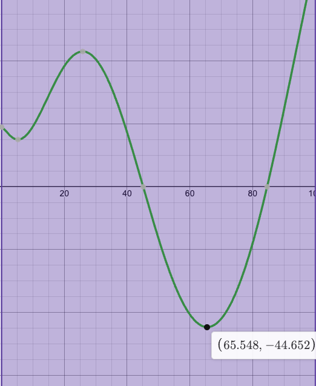
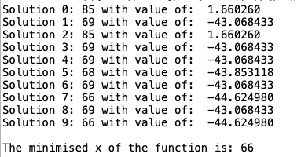

# Genetic-Algorithm-Minimization

## What is a genetic algorithm?

A genetic algorithm is an optimization technique inspired by the process of natural selection and genetics, which can be used to solve problems that a traditional iterative process may be inefficient.

Consider the scenario where we want to search for a solution in a given search space. We could construct a search tree, however, a tree is seen as a combinatorial explosion, where the number of nodes to search increases exponentially with the number of layers, with a time complexity of O(b^d) where b is the average branching factor, and d is the depth of the tree. This becomes very computationally expensive so we use genetic algorithms, or more generally evolutionary algorithms.

## Brief walkthrough

 1) Representation encoding
    - We need to find a way of representing solutions in the search space such that we can perform these genetic operations
    - In general, we call a solution a chromosome and each part of the encoded version, such as bits, genes
    - Bitstrings for optimisations, or permutation encoding for shortest path problems

 2) Parent selection
    - Selecting two parents, so that we can create two offspring by combining the parents
    - Exploits survival of the fittest, by selecting the fittest parents from some selection 
    - Tournament selection or roulette wheel selection
 
 3) Crossover
    - Combining the genetic material of two parents to create two offspring
    - Different ways of doing this, such as one-point crossover or uniform crossover

 4) Mutation
    - Randomly changing individual bits or genes in a given solution, so that we don't prematurely converge 

## How does the code work

Generally, the code written works in the same way. I used bitstrings to represent the solutions, this is so when applying crossover or mutation, we can manipulate the solution with the bits or genes individually. For parent selection, I used tournament selection, which means that we select the best of n randomly selected parents in the tournament. For crossover, I used uniform crossover, which is modifying the solutions bit by bit using a crossover template, where 0 means swapping the two bits, and 1 means keeping them the same. There are also different parameters which can be altered, such as tournament size, number of generations, crossover and mutation rate, as well as a few more.

This process is continued over 1000 generations and the program will converge on a good set of values, where at the end, the fittest one is returned.

### Example

Let's say we want to minimise a function f(x) = 18.9829 - x * sin(√|x|), in the domain 0 <= x <= 100

Where this function looks like the below:

When entering the specific domain into the program, as well as the function, it converges to a set of values as shown below: 

The majority of solutions converged to the actual minimum value +- 3, which is a good approximation. Some didn't, which could be due to the parameters passed into crossover and mutation rate, which is just the probability of applying those genetic operators. In addition, population or tournament size could have been a reason as to why these didn't converge, more experimentation can be done to get better results in terms of the population converging, but we found an almost perfect solution which is what matters!

